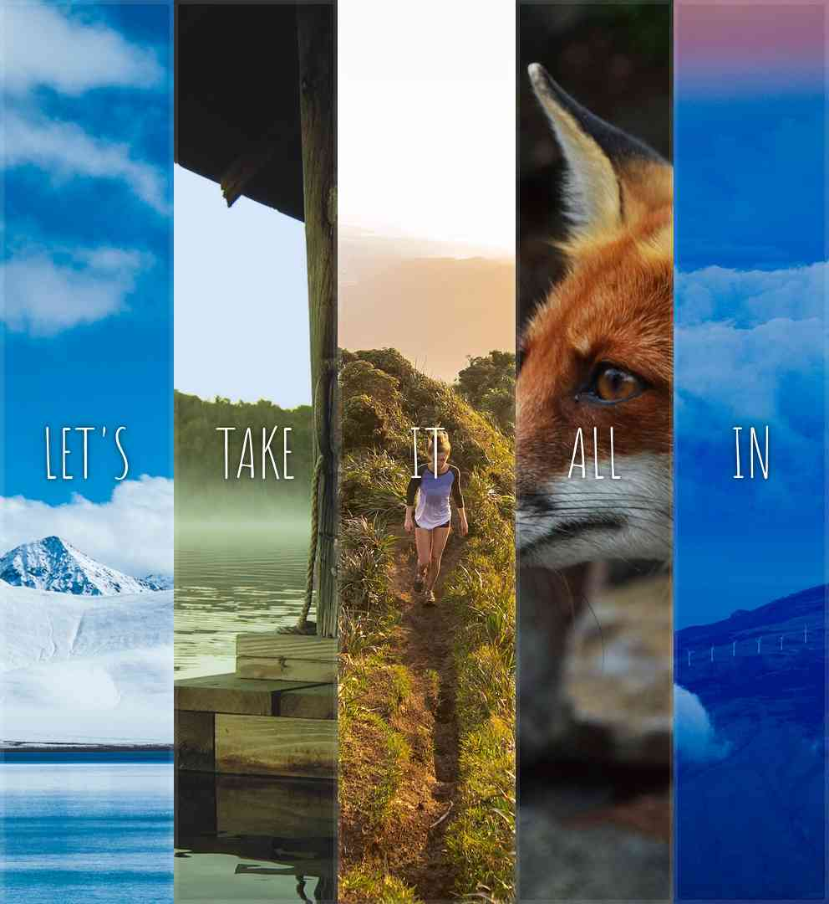

# Welcome

## Info

- This Website coded by [Z-Najdaoui](https://github.com/Z-Najdaoui)
- 2023/01/28
- last Edit 2023/01/28
- chalenge 5 from [WesBos](https://courses.wesbos.com/account/access/63906d2f40307fbbdeec4148/view/194130650), JavaScript30

## Summary

- I used in css:
  - select child (first/last-child)
  - trasform in x and y
  - some flex-box
- Thanks for take a look to This :) . . .

## Designe

### Desktop

### Mobile

